  body { font-family:Calibri; font-size:16pt } h1, h2, h3, p { margin:0pt 0pt 10pt } li { margin-top:0pt; margin-bottom:10pt } h1 { margin-top:24pt; margin-bottom:0pt; page-break-inside:avoid; page-break-after:avoid; line-height:normal; font-family:'Calibri Light'; font-size:16pt; font-weight:bold; color:#5b9bd5 } h2 { margin-top:10pt; margin-bottom:0pt; page-break-inside:avoid; page-break-after:avoid; line-height:normal; font-family:'Calibri Light'; font-size:14pt; font-weight:bold; color:#5b9bd5 } h3 { margin-top:2pt; margin-bottom:0pt; page-break-inside:avoid; page-break-after:avoid; line-height:normal; font-family:'Calibri Light'; font-size:12pt; font-weight:normal; color:#1f4d78 } .BodyText { margin-top:9pt; margin-bottom:9pt; line-height:normal; font-size:12pt } .Compact { margin-top:1.8pt; margin-bottom:1.8pt; line-height:normal; font-size:12pt } .FirstParagraph { margin-top:9pt; margin-bottom:9pt; line-height:normal; font-size:12pt } .SourceCode { margin-bottom:10pt; line-height:normal; font-family:Consolas; font-size:11pt } .Title { margin-top:24pt; margin-bottom:12pt; text-align:center; page-break-inside:avoid; page-break-after:avoid; line-height:normal; font-family:'Calibri Light'; font-size:18pt; font-weight:bold; color:#2c6eab } span.BodyTextChar { font-size:12pt } span.Heading1Char { font-family:'Calibri Light'; font-size:16pt; font-weight:bold; color:#5b9bd5 } span.Heading2Char { font-family:'Calibri Light'; font-size:14pt; font-weight:bold; color:#5b9bd5 } span.Heading3Char { font-family:'Calibri Light'; font-size:12pt; color:#1f4d78 } span.PlaceholderText { color:#808080 } span.TitleChar { font-family:'Calibri Light'; font-size:18pt; font-weight:bold; color:#2c6eab } span.VerbatimChar { font-family:Consolas } .awlist1 { list-style:none; counter-reset:awlistcounter3\_0 } .awlist1 > li:before { content:'•'; counter-increment:awlistcounter3\_0 } .awlist2 { list-style:none; counter-reset:awlistcounter3\_0 1 } .awlist2 > li:before { content:'•'; counter-increment:awlistcounter3\_0 } .awlist3 { list-style:none; counter-reset:awlistcounter3\_0 3 } .awlist3 > li:before { content:'•'; counter-increment:awlistcounter3\_0 } .awlist4 { list-style:none; counter-reset:awlistcounter3\_0 4 } .awlist4 > li:before { content:'•'; counter-increment:awlistcounter3\_0 } .awlist5 { list-style:none; counter-reset:awlistcounter3\_0 5 } .awlist5 > li:before { content:'•'; counter-increment:awlistcounter3\_0 } .awlist6 { list-style:none; counter-reset:awlistcounter3\_0 6 } .awlist6 > li:before { content:'•'; counter-increment:awlistcounter3\_0 } .awlist7 { list-style:none; counter-reset:awlistcounter3\_0 7 } .awlist7 > li:before { content:'•'; counter-increment:awlistcounter3\_0 } .awlist8 { list-style:none; counter-reset:awlistcounter3\_0 10 } .awlist8 > li:before { content:'•'; counter-increment:awlistcounter3\_0 } .awlist9 { list-style:none; counter-reset:awlistcounter3\_0 14 } .awlist9 > li:before { content:'•'; counter-increment:awlistcounter3\_0 } .awlist10 { list-style:none; counter-reset:awlistcounter3\_0 17 } .awlist10 > li:before { content:'•'; counter-increment:awlistcounter3\_0 } .awlist11 { list-style:none; counter-reset:awlistcounter3\_0 20 } .awlist11 > li:before { content:'•'; counter-increment:awlistcounter3\_0 } .awlist12 { list-style:none; counter-reset:awlistcounter3\_0 22 } .awlist12 > li:before { content:'•'; counter-increment:awlistcounter3\_0 } .awlist13 { list-style:none; counter-reset:awlistcounter3\_0 24 } .awlist13 > li:before { content:'•'; counter-increment:awlistcounter3\_0 } .awlist14 { list-style:none; counter-reset:awlistcounter1\_0 } .awlist14 > li:before { content:' '; counter-increment:awlistcounter1\_0 } .awlist15 { list-style:none; counter-reset:awlistcounter1\_0 1 } .awlist15 > li:before { content:' '; counter-increment:awlistcounter1\_0 } .awlist16 { list-style:none; counter-reset:awlistcounter3\_0 27 } .awlist16 > li:before { content:'•'; counter-increment:awlistcounter3\_0 } .awlist17 { list-style:none; counter-reset:awlistcounter3\_0 29 } .awlist17 > li:before { content:'•'; counter-increment:awlistcounter3\_0 } .awlist18 { list-style:none; counter-reset:awlistcounter3\_0 31 } .awlist18 > li:before { content:'•'; counter-increment:awlistcounter3\_0 } .awlist19 { list-style:none; counter-reset:awlistcounter1\_0 4 } .awlist19 > li:before { content:' '; counter-increment:awlistcounter1\_0 } .awlist20 { list-style:none; counter-reset:awlistcounter1\_0 5 } .awlist20 > li:before { content:' '; counter-increment:awlistcounter1\_0 } .awlist21 { list-style:none; counter-reset:awlistcounter1\_0 6 } .awlist21 > li:before { content:' '; counter-increment:awlistcounter1\_0 } .awlist22 { list-style:none; counter-reset:awlistcounter3\_0 33 } .awlist22 > li:before { content:'•'; counter-increment:awlistcounter3\_0 } .awlist23 { list-style:none; counter-reset:awlistcounter3\_0 36 } .awlist23 > li:before { content:'•'; counter-increment:awlistcounter3\_0 } .awlist24 { list-style:none; counter-reset:awlistcounter3\_0 39 } .awlist24 > li:before { content:'•'; counter-increment:awlistcounter3\_0 } .awlist25 { list-style:none; counter-reset:awlistcounter3\_0 42 } .awlist25 > li:before { content:'•'; counter-increment:awlistcounter3\_0 } .awlist26 { list-style:none; counter-reset:awlistcounter3\_0 45 } .awlist26 > li:before { content:'•'; counter-increment:awlistcounter3\_0 } .awlist27 { list-style:none; counter-reset:awlistcounter3\_0 49 } .awlist27 > li:before { content:'•'; counter-increment:awlistcounter3\_0 } .awlist28 { list-style:none; counter-reset:awlistcounter3\_0 52 } .awlist28 > li:before { content:'•'; counter-increment:awlistcounter3\_0 } @media (max-width: 900px) { img { max-width: 100%; height: auto; } .table-container { overflow-x: auto; -webkit-overflow-scrolling: touch; } table { width: 100%; border-collapse: collapse; } td, th { padding: 8px; text-align: left; border: 1px solid #ddd; } }

Windowed Periodogram

The **windowed periodogram** is a widely used technique for estimating the _Power Spectral Density (PSD)_ of a signal. It enhances the classical periodogram by mitigating spectral leakage through the application of a windowing function. This technique is essential in signal processing for accurate frequency-domain analysis.

Power Spectral Density (PSD)
----------------------------

The PSD characterizes how the power of a signal is distributed across different frequency components. For a discrete-time signal, the PSD is defined as the Fourier Transform of the signal’s autocorrelation function:

Sx(f) = FT{Rx(τ)}

Here, Rx(τ)}is the autocorrelation function.

         **FT :** Fourier Transform

Classical Periodogram
---------------------

The periodogram is a non-parametric PSD estimation method based on the Discrete Fourier Transform (DFT):

Px(f) = 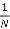 |X(f)|2

Here:

*                 **X(f):** DFT of the signal x(n)
*                 **N:** Signal length

However, the classical periodogram suffers from spectral leakage due to abrupt truncation of the signal.

Windowing to Mitigate Spectral Leakage
--------------------------------------

### Spectral leakage can be minimized by applying a window function to the signal before computing the DFT. The resulting PSD estimate is called the _windowed periodogram_:

Pw(f) = 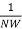 |Xw(f)|2

Here:

*                 **w(n):** Window function
*                 **W:** Window normalization factor

### Common Window Functions

*                 **Rectangular Window:** Equivalent to the classical periodogram.

w\[n\]\=1, 0≤n≤N−1

w\[n\]=0, otherwise

Where, N is the window length

*                 **Hamming Window:** Reduces sidelobe amplitudes, improving frequency resolution.

w\[n\]\=0.5(1−cos()), 0≤n≤N−1

Where, N is the window length

*                 **Hanning Window:** Similar to Hamming but with less sidelobe attenuation.

w\[n\]\=0.54 – 0.46cos(), 0≤n≤N−1

           Where, N is the window length

*                 **Blackman Window:** Offers even greater sidelobe suppression but at the cost of wider main lobes.

w\[n\]\=0.42 – 0.5(cos() + 0.08(cos(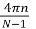), 0≤n≤N−1

Where, N is the window length

Implementation Steps
--------------------

1.  **Segment the Signal:** Divide the signal into overlapping or non-overlapping segments of length N.
2.  **Apply a Window Function:** Multiply each segment by a window function w(n).
3.  **Compute the DFT:** Calculate the DFT of the windowed segments.
4.  **Average the Periodograms:** For overlapping segments, average the periodograms to reduce variance.

Properties of the Windowed Periodogram
--------------------------------------

*                 **Bias:** Windowing introduces bias in the PSD estimate as the window modifies the signal spectrum.
*                 **Variance:** Averaging periodograms (Welch method) reduces variance but decreases frequency resolution.
*                 **Trade-Off:** The choice of window affects the trade-off between spectral resolution and leakage suppression.

Applications
------------

*                 Signal Processing: Analyzing frequency content of time-varying signals.
*                 Communications: Evaluating spectrum occupancy in wireless systems.
*                 Bioinformatics: Investigating periodicities in biological signals (e.g., EEG, ECG).
*                 Seismology: Characterizing seismic wave frequencies.

Correlogram

The **Correlogram** method is one of the simplest techniques for estimating the _Power Spectral Density (PSD)_ of a signal. It is based on the Fourier Transform of the estimated autocorrelation function of the signal.

Power Spectral Density (PSD)
----------------------------

The PSD describes how the power of a signal is distributed over different frequency components. For a discrete-time signal, the PSD is computed as the Discrete-Time Fourier Transform (DTFT) of the autocorrelation function:

Sx(f) = 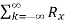\[k\] e\-j2π f k

Where Rx\[k\] is the autocorrelation function of the discrete-time signal.

Autocorrelation Function
------------------------

The autocorrelation function Rx\[k\] measures the similarity between a signal and a time-shifted version of itself. For a discrete-time signal x\[n\], it is defined as:

Rx\[k\] =   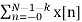x\[n+k\]\*

Where k is the lag and N is the signal length.

Steps to Compute Correlogram
----------------------------

**Estimate Autocorrelation:** Compute the unbiased or biased estimate of the autocorrelation function of the signal.

**Apply a Window:** To reduce spectral leakage, apply a window function to the autocorrelation sequence.

**Compute Fourier Transform:** Perform the Fourier Transform of the windowed autocorrelation function to estimate the PSD.

Windowing in Correlogram
------------------------

Windowing is essential to manage the trade-off between resolution and spectral leakage. Common windows include:

*                 **Rectangular Window:** No additional processing (equivalent to no window).
*                 **Hamming Window:** Reduces sidelobes effectively.
*                 **Hanning Window:** Provides smoother transitions at the edges.

Power Spectral Density Using N-point DFT
----------------------------------------

For a discrete-time signal sampled at N points, the Power Spectral Density (PSD) can be approximated using the magnitude squared of the Discrete Fourier Transform (DFT). The formula is given by:

Sx(fk) =  |X\[k\]|2, k = 0, 1, …, N-1

Where:

*                 X\[k\]: The N-point DFT of the signal x\[n\].
*                 N: The total number of samples.
*                 Sx(fk): The estimated PSD at frequency fk.

This approach is commonly used in digital signal processing for spectral analysis of finite-length signals.

Advantages
----------

*                 Simple to implement.
*                 Provides insight into the frequency-domain characteristics of signals.

Limitations
-----------

*                 Limited frequency resolution due to finite data length.
*                 Potential for spectral leakage if no windowing is applied.

Applications
------------

*                 Analyzing stationary signals in time-series data.
*                 Frequency-domain analysis in communication systems.
*                 Studying periodic patterns in biological signals.

Bartlett Method

The **Bartlett Method** is a technique for estimating the _Power Spectral Density (PSD)_ of a signal by dividing the signal into segments, computing the periodogram for each segment, and averaging the results. It provides a trade-off between bias and variance in spectral estimation.

Steps of the Bartlett Method
----------------------------

**Divide the Signal:** Segment the signal into M non-overlapping parts, each of length N.

**Compute the Periodogram:** For each segment, calculate the periodogram using the formula:

*                 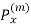 fk =  |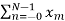\[n\] 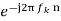|2
*                 Where:

xm\[n\]: The m-th segment of the signal.

N: The length of each segment.

fk: The frequency index.

**Averaging:** Average the periodograms of all segments:

*                 Px(fk) = 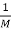 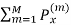 fk
*                 Where M is the number of segments.

Advantages
----------

*                 Reduces variance in PSD estimation compared to a single periodogram.
*                 Simple to implement.

Limitations
-----------

*                 Loss of frequency resolution due to segmenting the signal.
*                 Bias may remain if the signal is not stationary within segments.

Applications
------------

*                 Analyzing frequency content in stationary signals.
*                 Estimating PSD in communication systems.

Blackman-Tukey Method

The **Blackman-Tukey method** is a spectral estimation technique that estimates the _Power Spectral Density (PSD)_ of a signal using the autocorrelation function and a windowing technique. It is a non-parametric method that smoothens the spectral estimate to reduce variance and spectral leakage.

Steps of the Blackman-Tukey Algorithm
-------------------------------------

**Compute the Autocorrelation Sequence:**

*                 The autocorrelation Rx\[k\] of the signal \\x\[n\] is calculated as:  
    Rx\[k\] =   Σ x\[n\] x\[n + k\]

**Apply a Window Function:**

*                 A window w\[k\] is applied to the autocorrelation sequence to reduce noise and spectral leakage:  
    Rw\[k\] = Rx\[k\] w\[k\]

**Perform Fourier Transform:**

*                 The Fourier Transform of the windowed autocorrelation is computed to obtain the PSD:  
    Px(f) = FFT{ Rw\[k\]}

Mathematical Representation
---------------------------

The estimated Power Spectral Density (PSD) using the Blackman-Tukey method is given by:

Px(f) \= FFT{ Rx\[k\] w\[k\] }

Here:

*                 Rx\[k\]: Autocorrelation function
*                 w\[k\] : Window function
*                 **FFT :** Fast Fourier Transform

Advantages
----------

*                 Reduces spectral leakage through windowing.
*                 Smoothens the power spectral estimate, reducing variance.
*                 Flexibility in choosing different window functions (e.g., Hamming, Hanning, Blackman).

Disadvantages
-------------

*                 Lower frequency resolution due to windowing effects.
*                 Computationally expensive for large signals.
*                 Accuracy depends on the choice of window length and type.

Example Pseudo-Code
-------------------

 1\. Compute the autocorrelation sequence of the signal.  
2\. Apply a window function (e.g., Blackman window) to the autocorrelation.  
3\. Perform FFT on the windowed autocorrelation sequence to obtain the PSD.  
4\. Plot the PSD for visualization.

Applications
------------

*                 Analysis of radar and sonar signals.
*                 Audio and speech signal processing.
*                 Power spectral density estimation in communications systems.

Welch Method

The **Welch Method** is a widely used technique for estimating the _Power Spectral Density (PSD)_ of a signal. It improves upon traditional periodogram methods by reducing variance through segmenting, windowing, and averaging the data.

Steps in Welch Method
---------------------

**Segment the Signal:** Divide the signal into overlapping segments (typically 50% overlap).

**Apply a Window Function:** Apply a window (e.g., Hamming or Blackman) to each segment to reduce spectral leakage.

**Compute the Periodogram:** For each segment, compute the periodogram using the Fast Fourier Transform (FFT).

**Average the Periodograms:** Average the periodograms of all segments to obtain the final PSD estimate.

Mathematical Representation
---------------------------

The PSD estimate using Welch's method is given by:

Pxx(f) = 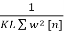|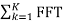 { xx\[n\].w\[n\] }|2

Where:

*                 K: Number of segments
*                 L: Length of each segment
*                 w\[n\]: Window function
*                 xk\[n\]: kth segment of the signal

Advantages
----------

*                 Reduces variance by averaging multiple segments.
*                 Allows flexibility in segment length, overlap, and window choice.
*                 Minimizes spectral leakage with windowing.

Disadvantages
-------------

*                 Lower frequency resolution due to overlap and windowing.
*                 Increased computational cost for larger signals.

Manual Implementation Steps
---------------------------

If you want to implement the Welch method manually, follow these steps:

1.  Divide the signal into overlapping segments.
2.  Apply a window function to each segment.
3.  Compute the periodogram of each segment using FFT.
4.  Average the periodograms across all segments.